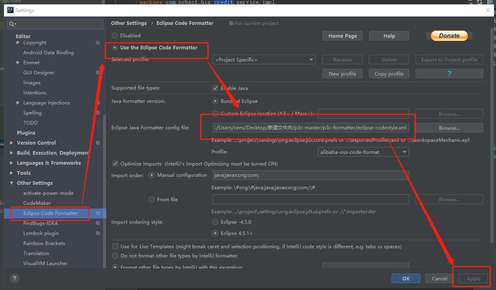

## 1.插件下载
* [Alibaba Java Coding Guidelines](https://plugins.jetbrains.com/plugin/10046-alibaba-java-coding-guidelines)
* [eclipse-code-formatter](https://plugins.jetbrains.com/plugin/6546-eclipse-code-formatter)
* [save-actions](https://plugins.jetbrains.com/plugin/7642-save-actions)
## 2.插件安装

[eclipse-codestyle](eclipse-codestyle.xml)
